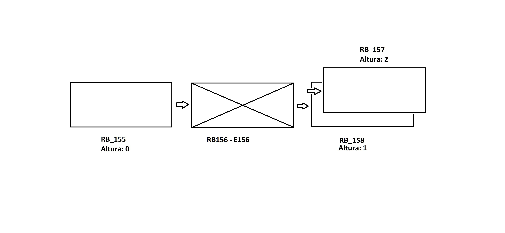
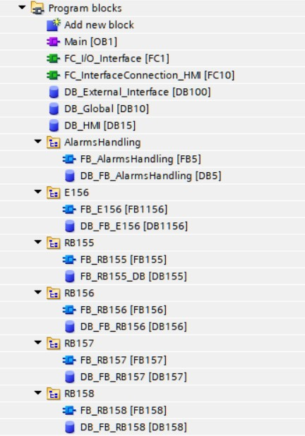
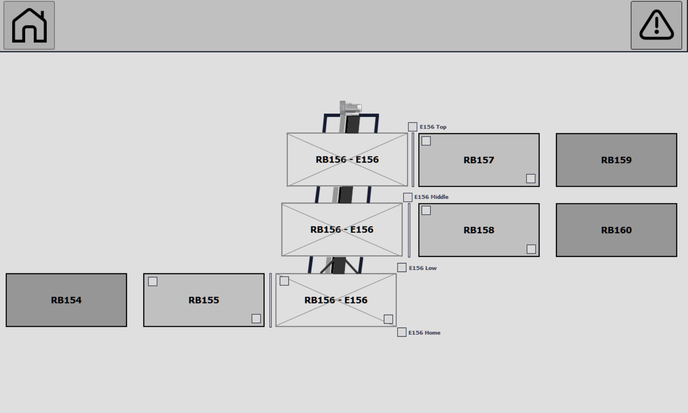
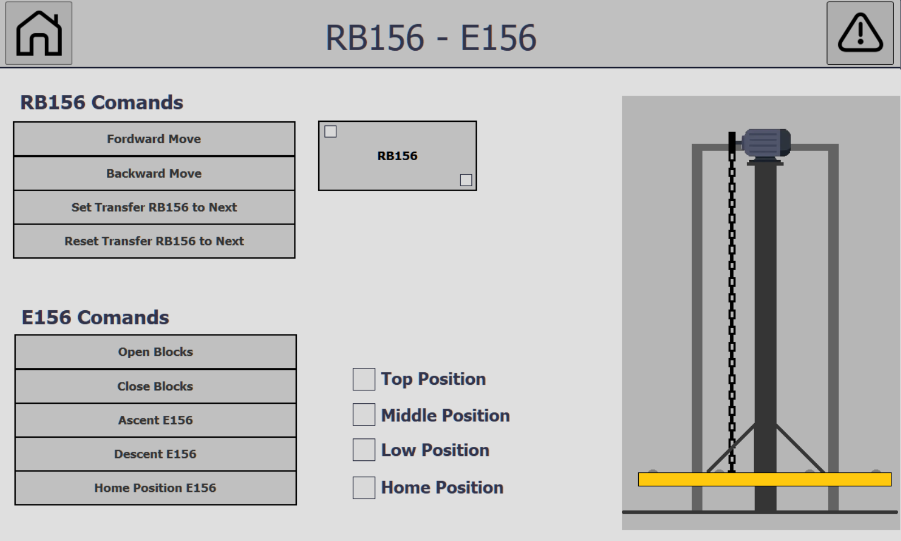
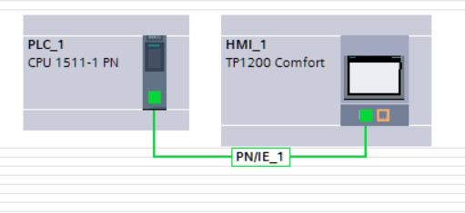

# Automotive Skid Elevator Station

PLC software for a body-shop skid elevator connecting roller bed conveyors across three vertical levels. Built as a hands-on exercise in **motion control and PLC-to-drive communication** — not a copy of any real installation, everything here was built from scratch as a learning project.

## Overview

- **RB155** — infeed roller bed, feeds the skid into RB156.
- **RB156 + E156** — physically one assembly: RB156 (a roller bed with its own open-loop drive) rides directly on top of the E156 platform-and-chain elevator.
- **E156** — the elevator itself. Closed-loop vertical axis, three levels (low / middle / high), raises RB156 (and the skid on it) to align with RB157 or RB158.
- **RB157 / RB158** — discharge roller beds, high and middle level.
- **RB154, RB159, RB160** — upstream/downstream stations outside this project's scope, modeled only as a simulated external interface (not full stations).

## Tech Stack

- **PLC:** Siemens S7-1511 (standard CPU — not "T", not "F")
- **HMI:** TP1200 Comfort, over PROFINET
- **Software:** TIA Portal V17 — LAD for interlocks/alarms, SCL for state machines and structured data
- **Drives:** two fully **simulated** SEW drives (not Siemens, deliberately not integrated through TIA's native drive tooling) — RB156's is open-loop (velocity + ramp only), E156's is closed-loop (position + velocity, absolute-encoder feedback)

## Control Sequence

- **Transfer handshake** between stations: Empty / Occupied / Transfer / Fault status bits + SetToNext / ResetToNext commands.
- **RB156** — open-loop: velocity setpoint in, its own ramp brings the skid to a smooth stop. No position anywhere in its interface.
- **E156** — closed-loop: the PLC sends target position + target velocity, follows an explicit Control Word / Status Word enable handshake, and never assumes the axis is ready without confirmation.
- **No classic homing** — every level has its own sensor, so every arrival is validated live (`IN_RANGE` position check + level sensor), instead of a homing routine run once at power-up. Recovery from a mismatch is a manual jog to a known sensor + a "set reference point" command.
- **Manual jog** stops at the nearest level in the commanded direction, even with the button held — no overshoot past a valid stop.

## Software Architecture

- One FB + one instance DB **per physical component** (`FB_RB155`, `FB_RB156`, `FB_E156`, `FB_RB157`, `FB_RB158`) — not a shared multi-instance block, for faster fault-finding during a line stop.
- `FC_I/O_Interface` — the only block touching physical addresses.
- `UDT_RB` — shared data type (ACT/SNS/CMD/ALM/STS), used only by the three identical roller beds (RB155/157/158).
- `RB156` and `E156` don't use `UDT_RB` — each carries its own `DRIVE` struct instead, shaped to match its own hardware (E156's includes position, RB156's doesn't).
- No Input/Output/InOut parameters — every FB reads/writes `DB_Global` directly.
- `FC_InterfaceConnection_HMI` + `DB_HMI` — decouples the HMI from the internal data model.
- `DB_External_Interface` — simulates RB154/RB159/RB160, with a toggling heartbeat per link, checked via an edge-triggered watchdog.
- Digital I/O and drive telegram data share the same byte-addressed process image — tags split into one table per station.

## Alarms Management

- **Distributed detection** — each component's FB detects and latches its own faults; `FB_AlarmsHandling` only consolidates for the HMI.
- **Latching, not re-evaluation** — alarms use `Set`, not a plain coil, so a transient fault stays visible until acknowledged. Reset is explicit, from the HMI only.
- **Alarm interlock** instead of a "first cause" variable — once the first alarm sets `Fault`, every other alarm-setting rung is locked out, so whatever tripped first is the one left visible. A few (thermal, breaker trips) always show regardless.
- Everything is non-retentive by default — a fault re-detects itself within a scan of any restart.

## Safety Integration

Doors, light barriers, and e-stops wire exclusively to a dedicated **Pilz safety relay** — never to the PLC directly. The S7-1511 isn't an F-CPU, so it can't join a PROFIsafe loop; safety decisions and motor disconnection happen entirely in hardware. The PLC only reads non-safety status bits (SafetyOk / EmergencyOn, door/barrier status) for HMI display and to block automatic mode.

## Manual Mode & Manual Maintenance Mode

One Auto/Manual selector for the whole station. Manual mode is still gated by the current sequence state; a key-switched maintenance mode bypasses those state checks for qualified personnel, but never bypasses the safety system.

## HMI

Home screen, Alarms screen, and one screen per component — including a combined `RB156_E156` screen, since they're physically one assembly.

## Notes

- E156 was originally a UDT — restarted as a plain Struct once its structure kept changing during development. RB156 hit the same issue later, once it needed its own drive data.
- SEW drives were simulated on purpose instead of Siemens ones, specifically to reason through the PLC-to-drive telegram by hand instead of letting TIA's tooling build it.
- Full write-up with the rest of the design reasoning: [`docs/Automotive_Skid_Elevator_Station.pdf`](docs/Automotive_Skid_Elevator_Station.pdf)

---

**Author:** A. Fernando Gola — 2026 · Project status: in active development
